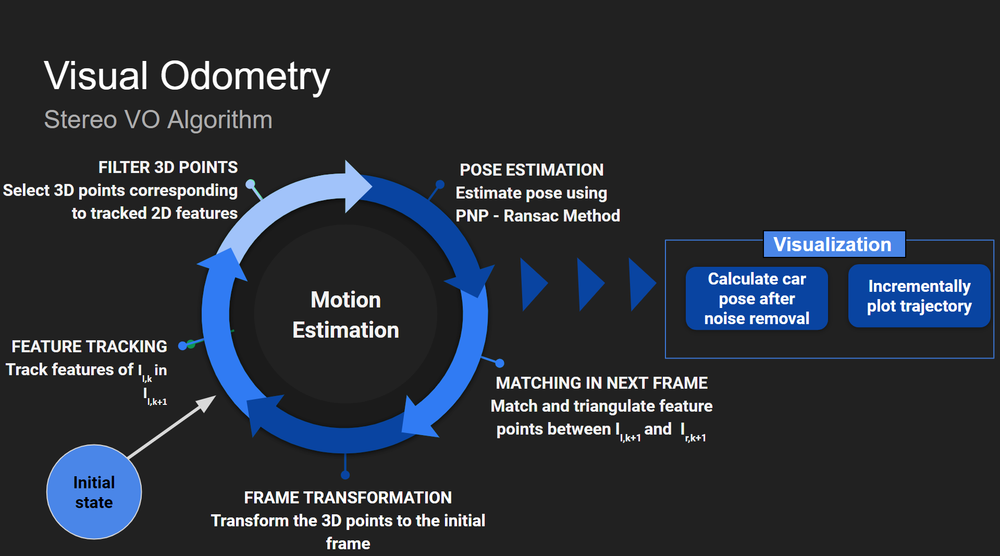

# Stereo-Visual-Odometry
> This is the implementation of Visual Odometry using the stereo image sequence from the KITTI dataset

[![Watch the full video]](https://www.youtube.com/watch?v=B-6oqZwLLEs&t=4s)

Visual Odometry is the process of incrementally estimating the pose of a vehicle using the images obtained from the onboard cameras. Its applications include, but are not limited to, robotics, augmented reality, wearable computing, etc. In this work, we implement stereo visual odometry using images obtained from the KITTI Vision Benchmark Suite and present the results the approache. We implement stereo visual odometry using 3D-2D feature correspondences. We find that between frames, using a combination of feature matching and feature tracking is better than implementing only feature matching or only feature tracking. Also, we find that stereo odometry is able a reliable trajectory without the need of an absolute scale as expected.

## Problem Formulation:

### Input
Our input consists of a stream of gray scale or color images obtained from a pair of cameras. This data is obtained from the KITTI Vision Benchmark Suite. Let the pair of images captured at time k and k+1 be (Il,k, Ir,k) and (Il,k+1, Ir,k+1 ) respectively. The intrinsic and extrinsic parameters of the cameras are obtained via any of the available stereo camera calibration algorithms or the dataset

### Output
For every stereo image pair we receive after every time step we need to find the rotation matrix R and translation vector t, which together describes the motion of the vehicle between two consecutive frames. 

## Dataset
We use the `KITTI Vision Benchmark Suite`[link](http://www.cvlibs.net/datasets/kitti/), a very popular dataset used for odometry and SLAM.
> Link to dataset - https://s3.eu-central-1.amazonaws.com/avg-kitti/raw_data/2011_09_28_drive_0001/2011_09_28_drive_0001_sync.zip

## Algorithm Outline:

- Read left (Il,0) and right (Ir,0) images of the initial car position
- Match features between the pair of images 
- Triangulate matched feature keypoints from both images
- Iterate:
  - Track keypoints of Il,k in Il,k+1
  - Select only those 3D points formed from Il,k and Ir,k  which correspond to keypoints tracked in Il,k+1
  - Calculate rotation and translation vectors using PNP from the selected 3D points and tracked feature keypoints in Il,k+1
  - Calculate inverse transformation matrix, inverse rotation and inverse translation vectors to obtain coordinates of camera      with respect to world
  - The inverse rotation and translation vectors give the current pose of the vehicle in the initial world coordinates. Plot the elements of the inverse translation vector as the current position of the vehicle
  - Create new features for the next frame:
     - Read left (Il,k+1) and right (Ir,k+1) images 
     - Match features between the pair of images 
     - Triangulate matched feature keypoints from both images
     - Multiply the triangulated points with the inverse transform calculated in step (d) and form new triangulated points
     - Repeat from step 4.a 

